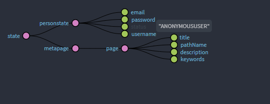
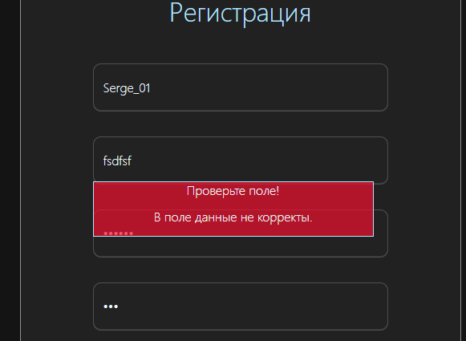

## ОБЗОР
Frontend веб-приложения с интеграцией ChatGPT API, системой аутентификации и красивым пользовательским интерфейсом.
---

## КОМАНДДЫ

- "`npm install package.json`" устанавливает зависимости;
- "`npm run lint`" - запускаем проверку кода на стилевые ошибки в ручную. Плюс, после отработки команд "`husk`" и "`prepare`" запускается автоматически при старте команды "`git commit`". "`--no-verify`" флаг отменяет проверку кода в момент запуска "`git commit`";
- "`npm run build`" - Сборка в режиме "`production`";
- "`npm run server`" - Запускаем сервер для рабзработок на локальном сервере ;
- "`npm run watchs`" - Сборка в режиме "`development`". Для разработкок запускаем после "`server`" (живую отслеживает изменения кода);
- "`npm run cssstyle`" - FW Tailwind запускается в начале работ. Отслеживает все изменения в коде при работе с Tailwind и "`daisyui.com`" (кода вставляем новые компанентый из Tailwind);
- "`npm run husk`" Запустить до "`prepare`". Создать файл "`pre-commit`" по маршруту "`*/.husky`'. В afqk файл "`pre-commit`" dнести запись "`npm run lint`";
- "`npm run prepare`": "husky".


##  ВЕРСТКА СТРАНИЦ ДЛЯ РЕАЛИЗАЦИИ

|**1. Регистрация пользователя**||**2. Подтверждение email**|
|:----|:----|:----|
|Форма с полями: email, пароль, подтверждение пароля, имя||Ввод кода подтверждения|
|Валидация на клиенте и сервере||Возможность переотправки кода|
|Отправка кода подтверждения на email||Таймер до повторной отправки|
|Макет: *public/Регистрация.pdf*||Макет: *public/Регистрация 2 (код с почты).pdf*|


|**3. Личный кабинет**||**4. Пополнение баланса**|
|:----|:----|:----|
|Информация о пользователе||Форма пополнения (без реального платежа)|
|Баланс коинов||Простое начисление коинов|
|История операций||История пополнений|
|Настройки аккаунта||Макет: *public/Экран пополнения.pdf*|
|Макет: *public/Личный кабинет.pdf*|||

|**5. Генерация контента**|||
|:----|:----|:----|
|Интерфейс для работы с ChatGPT||Ввод промпта и получение ответа|
|Списание коинов за запрос||История генераций|
|Макет: *public/Генерация в процессе.pdf*|||

## FRONTEND
- **Фреймворк**: React;
- **Язык**: **TypeScript**;
- **Стили**: CSS-фреймворк Tailwind, SCSS;
- **Адаптивность**: Мобильная, планшет, ноутбук  и десктопная версии

### Redux.metapage
Свойства/meta страницы.
```ts
// src\reduxs\store.ts
const pageSlice = createSlice({
    name: "metapage",
    initialState: clearPageState,
    reducers: {
        resetPageMeta: () => clearPageState,
        setCurrentMeta: (state, action: PayloadAction<PageMeta>) => {
            /**
             * state.page.title = action.payload.page.title;
             * state.page.description = action.payload.page.description;
             * state.page.keywords = action.payload.page.keywords;
             * ....
             */
            state = action.payload;
            return {...state};
        },
    },
});
```
```ts
// src\interfaces.ts
 export interface PageMeta {
    page: {
        title: string,
        description: string,
        keywords: Array<string>,
        pathName: string,
    }

 }
```
Свойства страницы передаются через redux. Создана прослушка которая получает данные/свойства страницы и передаёт.
```ts
//src\components\Router\index.tsx
export const MetaListener = () => {
  const dispatch = useDispatch();

  useEffect(() => {
    const pathname =  window.location.pathname.toLowerCase().trim();
    const pageName =
      pathname.includes("register") ? "Регистрация" :
      pathname.includes("login") ? "Авторизуйтесь" :
      pathname.includes("profile") ? "Профиль" :
      pathname.includes("/profile/deposit") ? "Депозит" :
      pathname.includes("generate") ? "Генерация" :
      pathname.includes("/register/referral") ? "Реферальная ссылка" : "Главная";

    const state: PageMeta = {
      page: {
        title: pageName,
        pathName: pathname,
        description: "",
        keywords: [],
      },
    };

    dispatch(setCurrentMeta(state));
  }, [location.pathname, dispatch]);

  return null;
};
```
## Redux


### Redux.personstate
Свойства пользователя/персоны
```ts
// src\reduxs\features\userstate\personSlice.ts
const personSlice = createSlice({
    name:"personstate",
    initialState,
    reducers:{
        resetPerson: () => {
            localStorage.removeItem("person");
        return clearState;
        },
        setPerson:(state, action: PayloadAction<StatePerson>) => {
            state = action.payload;
            return {...state};
        },
    },
});

```
```ts
// src\interfaces.ts

export enum UserStatus {
  STATUS_ADMIN = "ADMIN",
  STATUS_USER = "USER",
  STATUS_SUPER_ADMIN = "SUPER_ADMIN",
  STATUS_ANONYMOUSUSER = "ANONYMOUSUSER"
}
// BasisData 
// DataForDAPI
export interface StatePerson extends DataForDAPI {
    "status": string
}
```
Пользователь имеет два рабочих статуса. Это клиент "`USER`" страницы и аноним "`ANONYMOUSUSER`".


## Форма регистрации
Поля имеют [валидатороты](./src/pages/validators).
1) Вначале, все поля проверяютя "А есть ли вообще данные в поле". 
2) После, каждое поле отдельно проверяется на соответствие шаблонам (rege-вырожениям).

Каждое поле, в случае не соответствия, получаем сообщение.\


Note: Сообщение о несоответствии данных проподает при повторном нажатии на  знопку "Зарегистрироваться".
Все проверки на валидность запускаются разом и основной поток не ожидает выполнение проверок на валидность.
```ts
Promise.allSettled([
            async_regex_validate_of_username((inputUserName as HTMLInputElement).value),
            async_regex_validate_of_email((inputEmail as HTMLInputElement).value),
            async_regex_validate_of_password((inputPassword as HTMLInputElement).value),
            async_regex_validate_of_password((inputPasswordDuplicate as HTMLInputElement).value),
            (async () => ((inputPassword as HTMLInputElement).value === (inputPasswordDuplicate as HTMLInputElement).value) ? true : false)(),
            (async () => (InputCheckbox as HTMLInputElement) && (InputCheckbox as HTMLInputElement).checked ? true : false)()
        ]).then((response)=>{})
```
Валидные данные, в качестве data-form, [отправляся на сервер](src/pages/components/Register/handlers/handlerForm.ts) в "`POST-request`".

в cache  добавить закешированного юзера. с ключём 'person'

При логировании данные поступают на фронт.\
Токены в куки.\
person кешируется. Сделать из него байт код перевести в строку и кешировать.

----- 'person' -----
Каждый запрос на сервер, в авторизованном виде, содержит токены.\

